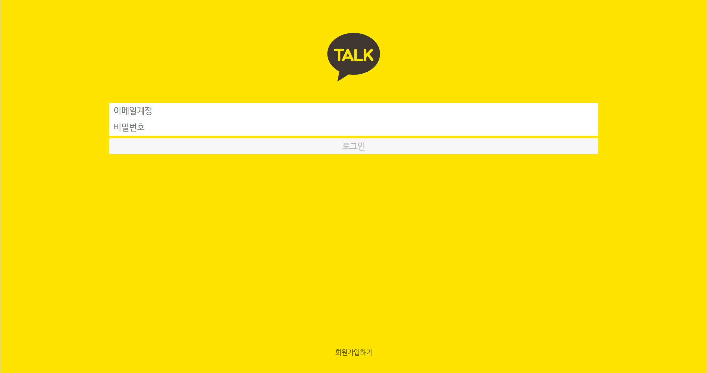
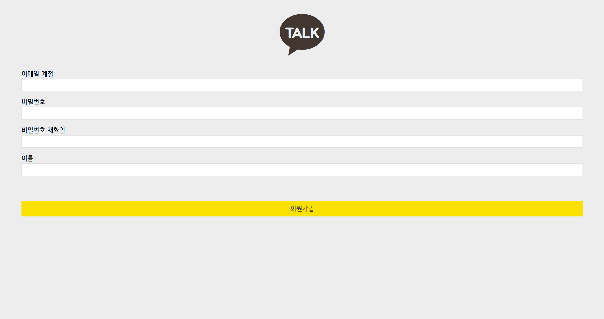
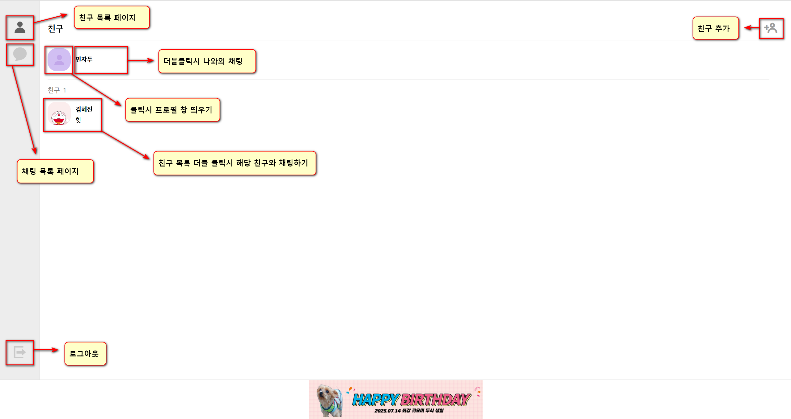
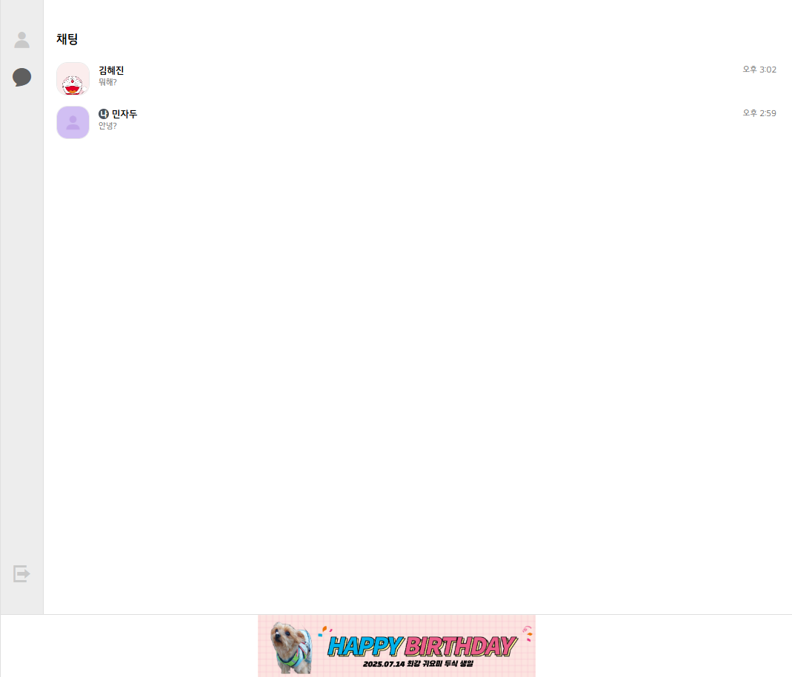
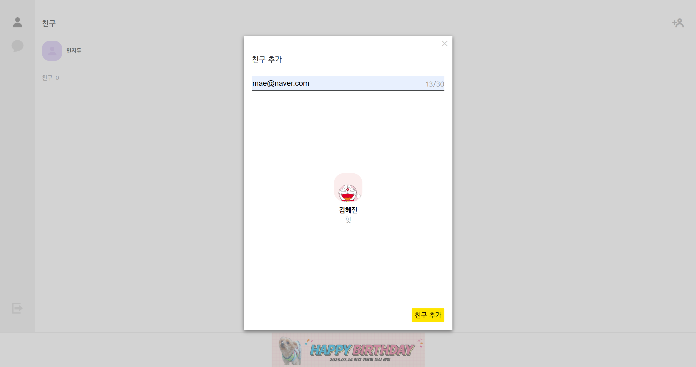
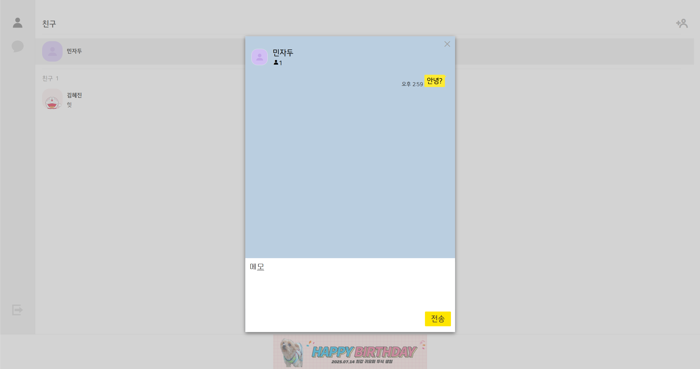
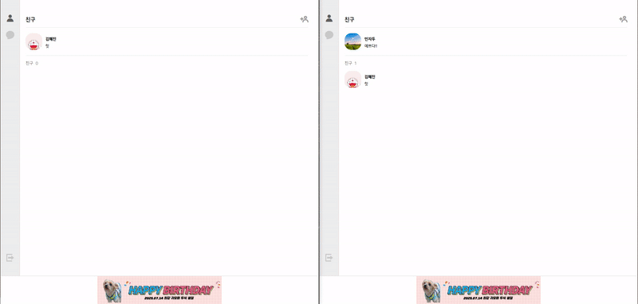
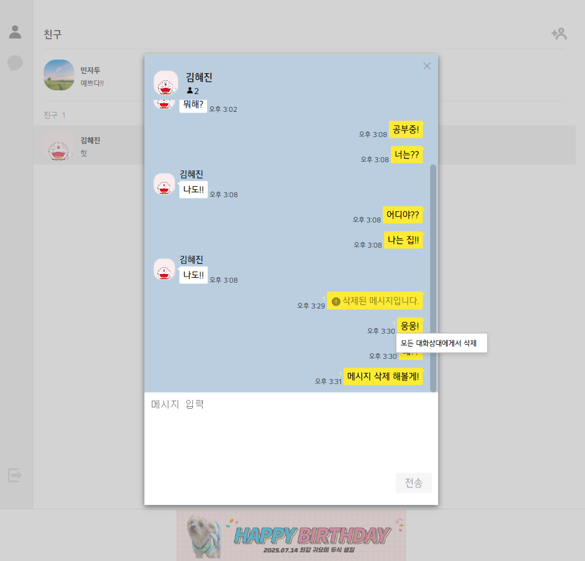
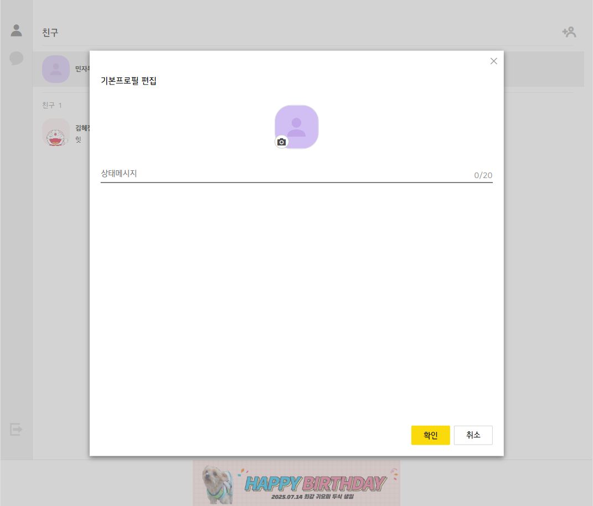

## 카카오톡 클론 프로젝트

> **React + TypeScript + Socket.IO + Express 기반의 실시간 채팅 서비스**

### 🎯 프로젝트 목표

- React와 TypeScript 학습
- 백엔드 구축 및 배포 경험
- Socket.IO를 활용한 실시간 기능 구현
  
### ✅ 기술적 특징

- **Socket.IO**: 실시간 채팅 구현
- **JWT**: 사용자 인증 및 보안 처리
- **Recoil**: 상태 관리
- **AWS + Docker + Nginx**: 배포 환경 구성
- **무한 스크롤**: 스크롤 될시 일정 갯수의 메시지 데이터만 출력

<br/>

**현재 진행 상태:** 기능 추가 + 디버깅 중

<br>

## 🚀 배포 링크

**[https://talko.jinproject.xyz/login](https://talko.jinproject.xyz/login)**

### 테스트 계정

- **아이디1:** `test​@naver.com` / **비밀번호:** `1234`
- **아이디2:** `test2​@naver.com` / **비밀번호:** `1234`

<br>

## 🛠 기술 스택

<div align="center">
  
  
  
  
  
  
  
  
  
  
</div>

<br>

## 📖 프로젝트 구조

<details>
<summary><b>디렉토리 구조 보기</b></summary>

```plaintext
📦 kakao-talk
 ┣ 📂 client
 ┃ ┣ 📂 public
 ┃ ┣ 📂 src
 ┃ ┃ ┣ 📂 api (API 요청)
 ┃ ┃ ┣ 📂 assets (이미지, 아이콘)
 ┃ ┃ ┣ 📂 components (UI 컴포넌트)
 ┃ ┃ ┣ 📂 recoil (상태 관리)
 ┃ ┃ ┣ 📂 routes (페이지 라우팅)
 ┃ ┃ ┣ 📂 sockets (소켓 통신)
 ┃ ┃ ┣ 📂 utils (유틸 함수)
 ┃ ┃ ┗ 📜 App.tsx (메인 앱)
 ┣ 📂 server
 ┃ ┣ 📂 config (설정 파일)
 ┃ ┣ 📂 controllers (비즈니스 로직)
 ┃ ┣ 📂 migrations (DB 마이그레이션)
 ┃ ┣ 📂 models (DB 모델)
 ┃ ┣ 📂 routes (API 엔드포인트)
 ┃ ┣ 📂 sockets (소켓 이벤트 핸들러)
 ┃ ┣ 📂 utils (공통 유틸 함수)
 ┃ ┗ 📜 server.js (서버 실행 파일)
 ┗ 📜 README.md
```

</details>

<br>

## 📌 데이터베이스 ERD

- **ERD (ERD Cloud):** [🔗 ERD 보기](https://www.erdcloud.com/d/rFyZbfuc4uZFQDGys)

<br>

## ✅ UX/UI 및 주요 기능

### 로그인 & 회원가입




### 친구 목록 페이지
  

### 채팅 목록 페이지
  

### 친구 찾기 및 추가
친구의 정확한 이메일을 검색해야 추가 가능합니다.



### 나와의 채팅
  

### 1:1 실시간 채팅 & 메시지 읽음 처리
메시지 창이 포커스 되어야 읽음 처리 가능 합니다.



### 메시지 삭제
보낸지 3분 이내의 메시지에 오른쪽 단추 클릭후 삭제 가능 합니다.


  
### 프로필 사진 변경
 

